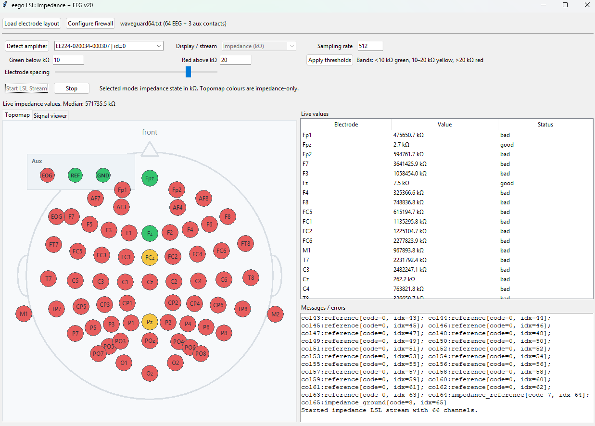

Tkinter-based Python app for ANT eego amplifiers.

It can:

- load an electrode layout (`.txt`, `.csv`, `.tsv`, `.json`),
- detect connected eego amplifiers,
- stream either impedance values or EEG activity to LSL,
- display electrode impedance on a topomap and EEG values numerically/signal-viewer only.



## Python version

This package is configured for the included 64-bit `eego-SDK.dll`, so use normal 64-bit Python 3.13 on Windows.

```bat
py -3.13 -m pip install -r requirements.txt
```

## Run

```bat
py -3.13 app.py
```

## Impedance colour scale

The topomap uses three adjustable impedance bands. The defaults are:

- **green:** `< 10 kΩ`
- **yellow:** `10–20 kΩ`
- **red:** `> 20 kΩ`

Change the two threshold boxes in the GUI and press **Apply thresholds**. The topomap and table update immediately for the latest impedance values.

## Signal viewer

The app now has two tabs: **Topomap** and **Signal viewer**. The signal viewer is written directly in Tkinter. It can display up to 64 channels.

Controls in the signal viewer:
- number of channels shown: 4, 8, 16, 32, 48, or 64;
- display scale in µV/div;
- optional high-pass filter, default `0.5 Hz`;
- optional low-pass filter, default `40 Hz`;
- optional notch filter: Off, 50 Hz, or 60 Hz.

The realtime filter is **display-only**. The outgoing LSL EEG stream remains raw microvolt data.

## LSL modes

Use the dropdown to choose:

- `Impedance (kOhm)`
- `EEG activity (µV)`

Then press **Start LSL Stream**. To change mode, press **Stop**, select the other mode, and start again.

## Stop behaviour

Pressing **Stop** now requests a full SDK stream close, which should also release the LSL outlet once the worker thread exits. The app waits until the worker confirms that the stream is closed before re-enabling the start controls.

## Notes

- The SDK usually permits only one active stream from the amplifier at a time, so impedance and EEG are treated as mutually exclusive modes.
- EEG values are assumed to come from the SDK in volts and are converted to microvolts before display/LSL streaming.
- If the app cannot load the SDK, make sure the ANT/eego runtime and license are installed correctly.

## Realtime display filter

The signal viewer filter is only applied to the visual trace display. It does not alter the LSL stream. Press **Apply filter** after changing filter settings; this resets the viewer buffer and filter state.

The app now checks on startup whether Windows Firewall rules exist for the program. If no rule is found, it asks whether to add inbound and outbound allow-rules for Private/Domain networks.

Important details:

- Windows requires administrator permission to add firewall rules.
- During development, the rule applies to `python.exe` because the app is launched through Python.
- The rules do not guarantee LSL visibility if the network itself blocks multicast/broadcast discovery, if the network profile is Public, if a VPN is active, or if a university/router firewall isolates devices.

You can also press **Configure firewall** in the app to run the firewall check manually.
